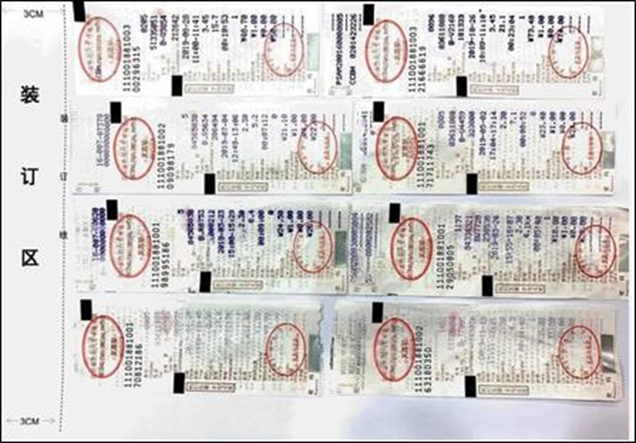
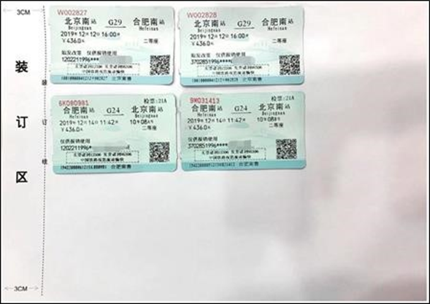
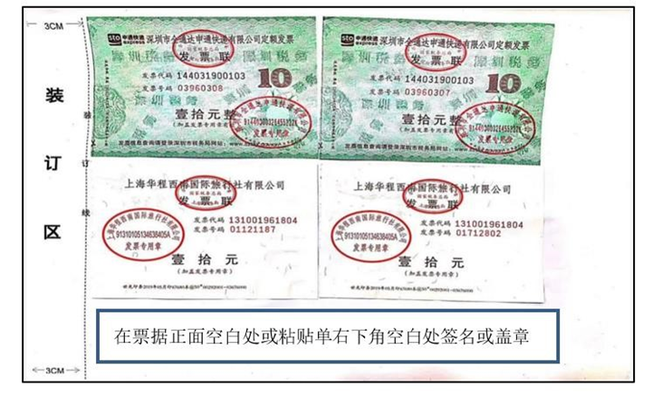
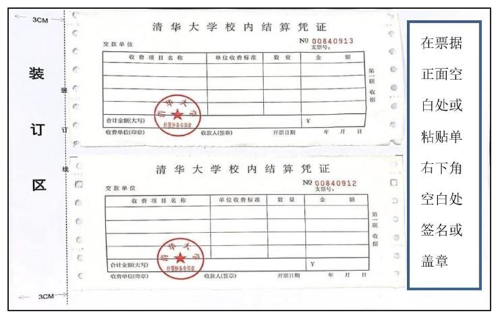
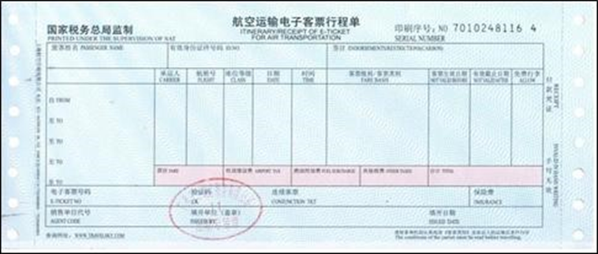
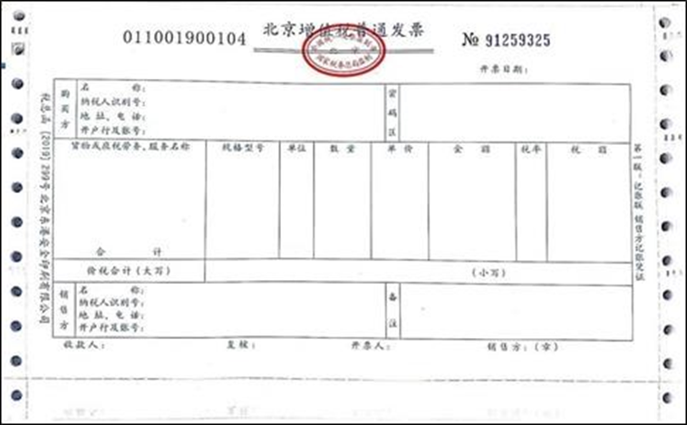
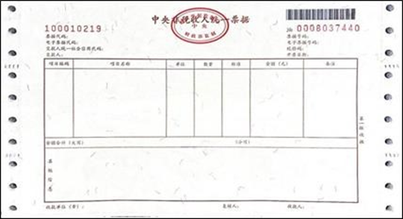

## **一、基本报销常识** 
### **（一）发票开具** 
**标准发票信息：**

- 单位名称：清华大学

    - 纳税人识别号：12100000400000624D

    - 增值税普通发票可以只填写单位名称、纳税人识别号，其他内容不强制填写。除非特殊要求，不要填写以下信息。

    - 地址、电话：北京市海淀区清华园 01062795627

    - 开户行及账号：工行海淀西区支行 0200004509089131550

    - 开票信息可在清华大学公众号：清华大学信息服务-财务信息服务-关于我们-常用信 息里查询。

- 名称：清华大学教育基金会

    - 税号：53100000500006919C

    - 单位地址：北京市海淀区中关村东路1号院3号楼12层1201

    - 电话：010-62794861

    - 开户银行：工行海淀北京市海淀西区支行

    - 银行账户：0200004509014447265

### **（二）支付记录**
1. 所有发票金额超过1000元，均需要提供支付记录，微信、支付宝、银行卡交易记录、交易短信均可（支付记录**不能是对个人**，必须显示商家信息）。 

2. 支付记录需要与发票金额一致，如不一致，需说明理由，支付记录金额大于发票面额，以发票面额为准；反之，以支付记录为准。 

3. 数额比较大可以采取借款或者直接对公转账的方式。

### **（三）发票真伪** 
所有纸质发票金额超过 5000 元，均需要[验证发票真伪](https://inv-veri.chinatax.gov.cn/)。 

发票金额最好不要超过10000元（**注意：严禁连号！**）

### **（四）其他**
1. 所有人在报销之前需要在info-自助报账（新）-系统管理-个人信息修改，绑定自己的银行卡。（应该都已经绑定了中行校园卡）

2. 所有报销票据均需要本人签字，备注学号；电子发票请自行打印。同时需填写《学生活动经费使用情况说明》，特别是文具、礼品购买等，说明用途。 

3. 发票严禁连号！严禁连号！严禁连号！ 

4. 凡是报销超市开具的发票，均需要对应相应的购物小票，且金额一致，否则无法报销。线下采购取得的实践物资、文印、制作、租车等票据，需要关注开具内容是否包括名称、规格、数量、单价等，如开票内容为大类，比如“图书”、“制作费”、“租车费”等，记得**保留购物小票或索要盖章明细材料**等。

5. 支队长需依据规范填写《学生活动说明》并将发票按照序号顺序标记好填写《学生报销明细表》。

6. 退票报销需要凭证，以退票的平台订单截图为例。

7. 注意市内交通报销额度、药品额度有上限，详见清华大学学生社会实践手册

8. 如需订购机票，需要情况说明。取得的“代订机票”等内容的纸质机打发票，备注栏上应有乘机人、起降时间、起降地、航班号、座舱等级等信息，否则记得**保留订单截图**。温馨提示：尽早订机票。

9. 个人往返机场费用，如能开具发票，发票抬头也需要写“清华大学”或“清华大学教育基金会”（切忌写个人名字）。

## **二、报销范围与额度**

本科生国内社会实践报销范围包括以下几部分内容：

1. 交通费：城市间交通费（飞机经济舱、高铁二等座、火车硬卧）、城市内交通费（公交、地铁、包中巴车）；可以报销下乡包车费用（其他交通形式不便）、往返机场费用。根据学校实践报销规范，出发地或者实践后地点不为北京的，取“北京->实践地->北京”闭环与实际闭环中价格更低者。
   
2. 住宿费：住宿本着精简节约的原则需两人一间，尽量找人合住，每人分开开具住宿发票及盖有公章的**酒店明细单**（亦称水单，应当可以看见所有在该房间住宿人员的姓名、入住时间、单价、房间号等信息，提醒酒店工作人员）。住宿费用最大额度可见附件。**不开具水单的，无法报销住宿费用。**原则上不高于《清华大学国内差旅住宿费标准明细表》中“其他人员”档的 1/2；
   
3. 必要物资采购费：办公用品、药品、印刷品、宣传品、支队自主设计的实践队服制作费、其他需经系团委审批的事项（如赠予实践地接待方的纪念品等）。

> 附件：[计算机科学与技术系本科生社会实践工作经费情况说明](https://cloud.tsinghua.edu.cn/f/b6814c4cc8bf4eac91e5/)

（4）实践期间餐费不予报销，不合理的住宿费用（如实践开始前多日为旅游到达或实践结束后为旅游留宿的）不予报销。

（5）**鼓励各支队产出更好的成果，获得更高的报销额度。**

（6）请各支队保管好发票。发票丢失的，除数额巨大确实必须报销外，不再予以特别处理。

## **三、票据上交方式**
（1）票据由支队长统一在指定日期前提交，提交时应仔细核对总额是否正确。不得超额上报。

（2）未能开具票据的或者商家拒绝开具票据的，应及时向实践口报销负责人员联系，尽可能为大家减少损失。

（3）报销款原则上统一打到支队长银行卡上，由支队长进行分发。票据在上交后不再发还，支队长应保存票据照片等，方便报销款分发。

（4）上交的所有票据上（支付记录除外）都应有支队长姓名、学号信息。所有票据应当整理好在上交（建议：文件袋、档案袋、回形针，**禁止使用订书机**），每张票据的正面空白处上都需要**支队长及支队财务员两人**使用黑色中性笔签字；如果支队长及支队财务员是同一人担任，则需要另一位支队成员共同签字，保证有两人签字。

（5）交通费票据粘贴时，同一个人的往返票据需要粘贴在一张或几张编号连续的A4纸上，且不同交通工具的报销票据不能粘贴在同一张纸上（例如火车票和机票行程单）。

（6）票据粘贴规范见下（A4纸横向平铺粘贴），A4纸应当根据要求编号排列，总的要求是要清晰明确：

* #### 出租车票粘贴示例 
<!--  -->

* #### 火车票粘贴示例 (一人一行或一列，要辨认出行程)
<!--  -->

* #### 定额发票粘贴示例 
<!--  -->

* #### 校内结算凭证粘贴示例 
<!--  -->

票据宽度大于或等于“航空运输电子客票行程单”的票据，如增值税发票、中央非税收入统一票据,以及 A4 纸大小的单据，如打印的增值税电子普通发票，同样需要粘贴，每张A4纸粘贴1张。（以下样例没有粘贴但上交时需要粘贴在A4纸上，要求与上述票据相同）

* #### 航空运输电子客票行程单 (行程单排列要看得出个人行程)
<!--  -->

* #### 增值税发票（纸质版） 
<!--  -->

* #### 中央非税收入统一票据 
<!--  
!-->

A4 纸打印的单据，如 A4 纸打印的增值税电子普通发票，A4 纸打印的合同、会议通知等，不需要粘贴。

未尽事宜，详询实践组。
